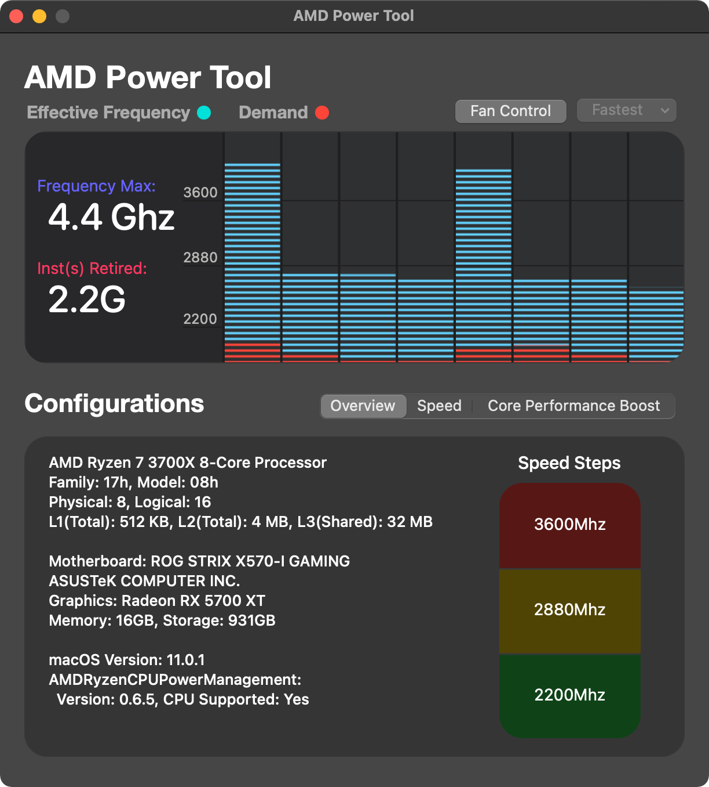

*This article was originally published to my blog on 2020-07-26. I've moved it here to be archived. This repo is no longer being updated.*

# macOS on the Asus ROG Strix X570‑I



## Scope

I will not be testing any alternative configurations unless required by my own system. The latest tested configuration is as follows:

- **BIOS:** [v3801](https://rog.asus.com/us/motherboards/rog-strix/rog-strix-x570-i-gaming-model/helpdesk_bios/)
- **Bootloader:** [OpenCore](https://github.com/acidanthera/OpenCorePkg)
- **SMBIOS:** `iMacPro1,1`
- **macOS:** Big Sur

## Relevant Hardware

- **Motherboard:** Asus ROG Strix X570-I
  - **Audio:** ALCS1220A
  - **Ethernet:** Intel i211AT
  - **Wi-Fi & Bluetooth Card:** Intel AX200
- **Processor:** AMD Ryzen 7 5800X, air-cooled
- **Storage:** WD_Black SN750 1TB M.2 NVMe
- **Video Card:** AMD Radeon RX 5700 XT

## BIOS Settings

- **Fast Boot** should be set to **Disabled**.
- **Above 4G Decoding** should be set to **Enabled** in v3001 and above.
Directly below, make sure **Re-Size BAR** is still set to **Disabled**.

## Getting Started

If you haven't already, you will first need to [create your installation media](https://dortania.github.io/OpenCore-Install-Guide/installer-guide/) and set up OpenCore. After that's finished, clone this repo and replace the corresponding OpenCore files and directories on your installation media.

This repo contains only the files that I've generated myself— config.plist, SSDTs, and USBPorts.kext.

### Kexts

To minimize clutter in the repo and to ensure that you're using the latest releases, the following kexts must be downloaded separately. Drop them into the Kexts folder in your EFI directory.

- [AirportItlwm.kext](https://github.com/OpenIntelWireless/itlwm/releases)
Support for Intel AX200 Wi-Fi.

- [AMDRyzenCPUPowerManagement.kext + SMCAMDProcessor.kext](https://github.com/trulyspinach/SMCAMDProcessor)
Power management and monitoring for AMD Ryzen.

- [AppleALC.kext](https://github.com/acidanthera/AppleALC)
Support for audio.

- [AppleMCEReporterDisabler.kext](https://github.com/acidanthera/bugtracker/files/3703498/AppleMCEReporterDisabler.kext.zip)
Disables AppleMCEReporter to prevent kernel panics.

- [IntelBluetoothFirmware.kext + IntelBluetoothInjector.kext](https://github.com/OpenIntelWireless/IntelBluetoothFirmware/releases)
Support for Intel AX200 Bluetooth.

- [Lilu.kext](https://github.com/acidanthera/Lilu)
Used for kext and process patching. Required to run macOS.

- [NVMeFix.kext](https://github.com/acidanthera/NVMeFix)
Compatibility with non-Apple SSDs.

- [SmallTreeIntel82576.kext](https://github.com/khronokernel/SmallTree-I211-AT-patch)
Support for ethernet.

- [VirtualSMC.kext](https://github.com/acidanthera/VirtualSMC)
Emulates the SMC of real Macs. Required to run macOS.

- [WhateverGreen.kext](https://github.com/acidanthera/WhateverGreen)
Various GPU patches.

### Resources

Extract the [binary resources](https://github.com/acidanthera/OcBinaryData) to this folder to enable the OpenCore GUI. The boot chime only works with audio jacks, not HDMI or DisplayPort, and is thus not configured or tested. This is covered [in the guide](https://dortania.github.io/OpenCore-Post-Install/cosmetic/gui.html).

### config.plist

Odds are that you don't have exactly the same hardware configuration as I do. Refer to [config.plist setup](https://dortania.github.io/OpenCore-Install-Guide/AMD/zen.html) in the OpenCore Install Guide and double-check that everything is correct. For example, if you are not using a Navi-based GPU, remove `agdpmod=pikera` from `boot-args`.

Serial numbers and system identifiers should not be shared, so mine have been removed. You will need to [generate your own](https://dortania.github.io/OpenCore-Install-Guide/AMD/zen.html#platforminfo) in order to use Apple's services.

⚠️ **Note:** Below BIOS v3001, you will need to add `npci=0x2000` to the `boot-args` of your `config.plist` as of [commit ac4cab3](https://github.com/ChanceArthur/macOS-EFI-Asus-X570I/commit/ac4cab3874d07cfe868b7b4336824675aa1dbfda). Remove it when updating to v3001 or above. Do not use `npci=0x2000` and have Above 4G Decoding enabled at the same time.

### EFI Directory Structure

```
EFI
|--- BOOT
|    |--- BOOTx64.efi
|
|--- OC
|    |--- ACPI
|    |    |--- SSDT-EC-USBX.aml
|    |    |--- SSDT-HPET.aml
|    |    |--- SSDT-SBUS-MCHC.aml
|    |
|    |--- Drivers
|    |    |--- AudioDxe.efi
|    |    |--- HfsPlus.efi
|    |    |--- OpenCanopy.efi
|    |    |--- OpenRuntime.efi
|    |
|    |--- Kexts
|    |    |--- AirportItlwm.kext
|    |    |--- AMDRyzenCPUPowerManagement.kext
|    |    |--- AppleALC.kext
|    |    |--- AppleMCEReporterDisabler.kext
|    |    |--- IntelBluetoothFirmware.kext
|    |    |--- IntelBluetoothInjector.kext
|    |    |--- Lilu.kext
|    |    |--- NVMeFix.kext
|    |    |--- SmallTreeIntel82576.kext
|    |    |--- SMCAMDProcessor.kext
|    |    |--- USBPorts.kext
|    |    |--- VirtualSMC.kext
|    |    |--- WhateverGreen.kext
|    |
|    |--- Resources
|    |    |--- Audio
|    |    |    |--- (...)
|    |    |
|    |    |--- Font
|    |    |    |--- (...)
|    |    |
|    |    |--- Image
|    |    |    |--- (...)
|    |    |
|    |    |--- Label
|    |    |    |--- (...)
|    |
|    |--- Tools
|    |    |--- (empty)
|    |
|    |--- config.plist
|    |--- OpenCore.efi
```

When you're finished, your EFI directory should look like this.

## Post-Installation

After installation has completed, you can copy your EFI folder from your installation media to your boot drive [by following the guide](https://dortania.github.io/OpenCore-Post-Install/universal/oc2hdd.html).

### Enabling Secure Boot

Secure Boot does not work with the macOS Installer, so it is disabled by default in the config.plist to allow your installation media to boot. When you've booted into your completed macOS installation, you can safely enable Secure Boot.

You will first need to [generate your own](https://dortania.github.io/OpenCore-Post-Install/universal/security/applesecureboot.html#apecid) ApECID and set `/Misc/Security/SecureBootModel` to `j137` within the config.plist, then reboot into Recovery.

When in Recovery, make sure you're connected to the internet in the top-right corner. Open Disk Utility and set the sidebar to "Show All Devices", then mount your volume's Data partition. Open Terminal and run the following command (assuming your volume's name is "Macintosh HD"):

```shell
bless bless --folder "/Volumes/Macintosh HD/System/Library/CoreServices" --bootefi --personalize && reboot
```

Your system should then successfully reboot into macOS.

Keep notes of your changes to config.plist for easier updates to newer revisions in the future. Serial numbers, unique identifiers, and Secure Boot settings will differ between mine and yours.

### Disabling MKL

MKL is an Intel math library that does not exist on AMD processors. When apps in macOS use MKL, such as Adobe products or Discord Voice, the apps will crash. Most of the time, this can be solved by disabling MKL system-wide using a LaunchAgent. See [AdobeAMDFix.md](https://gist.github.com/naveenkrdy/26760ac5135deed6d0bb8902f6ceb6bd). If you do not use Adobe products, skip to step 4.
